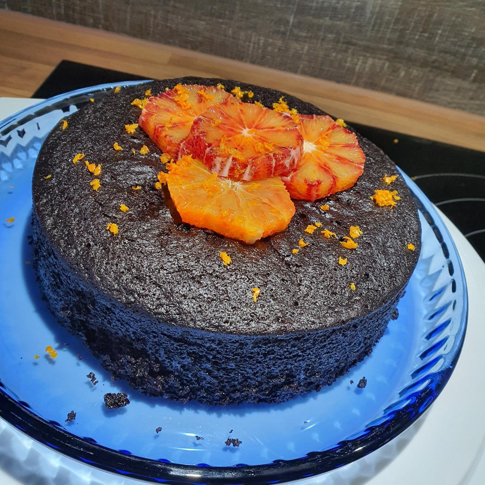

# Orange Olive Oil Cake

Olive Oil, even though usually not considered a lot as an ingredient in sweet baking, is surprisingly versatile and, in combination with the orange infusion, makes this particular cake one of the most moist and delicious things to ever grace the earth. (Seriously, you can keep it out for a week, it will not dry out.)

## Stats
- Cooking Time: 30-60min for infusion, ~20min mixing ingredients, ~40min baking
- Servings: 4-12 pieces (depending on how thick you slice it ;)

## Ingredients
- 5 blood oranges
- 120ml olive oil
- 185g all-purpose flour
- 80g dark, unsweetened cocoa powder
- 1.5tsp baking soda
- 250g sugar
- 240ml water
- 1.5tsp white/fruit vinegar

## Instructions
1. Zest all 5 blood oranges and divide between 3 separate small bowls: 2 bowls should contain the zest of 1 orange each, and 1 bowl should contain the zest of 3 oranges. Set aside the 2 bowls with less zest for later.
2. Add the olive oil to the bowl with the zest of 3 oranges. Set aside for 30-60 minutes to infuse.
3. Juice 3 of the oranges and set aside 3 tablespoons of juice for the glaze. Reserve the remaining orange juice in a liquid measuring cup. You should have about 120ml.
4. Preheat the oven to 180˚C.
5. In a large bowl, **sift** together the flour, cocoa powder, baking soda, and salt.
6. Add the sugar, blood orange olive oil (with the zest), 120 ml of the blood orange juice, water, and vinegar. Whisk until the batter is smooth with no lumps.
7. Lightly grease the bottom and sides of an 20-22cm round cake pan with olive oil, and place parchment paper in the bottom of the pan..
8. Pour the batter into the prepared pan and bake for 35-40 minutes, until a toothpick inserted in the center of the cake comes out clean.
9. While the cake bakes, prepare the topping: Cut the top and the bottoms off the 2 remaining zested oranges. Carefully remove the skin and pith from the oranges until you are left with just the flesh. Cut each orange into 6mm wide rounds. .
10. Remove the cake from the oven. Let it completely cool, then decorate the top with the orange slices and remaining orange zest.
11. Enjoyy! :))

# Comments
No, it is not burned. There's a lot of unsweetened cocoa in there, it's supposed to be that dark.
